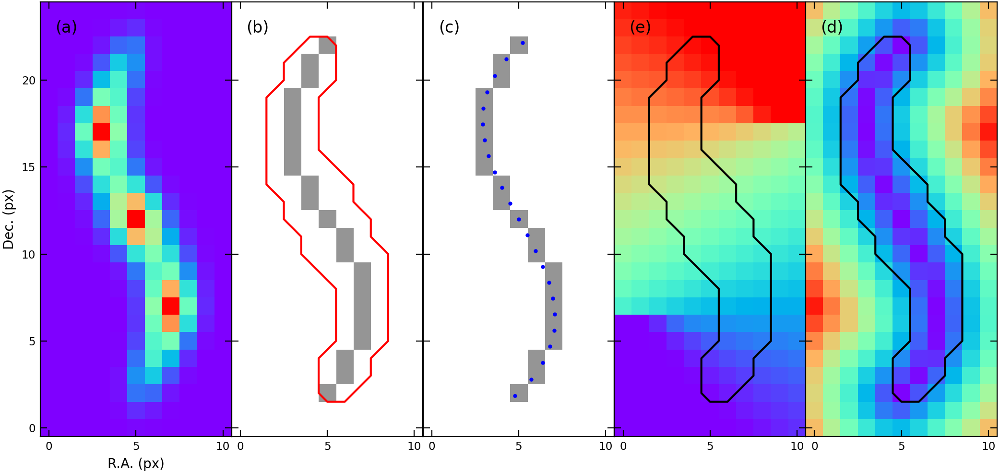
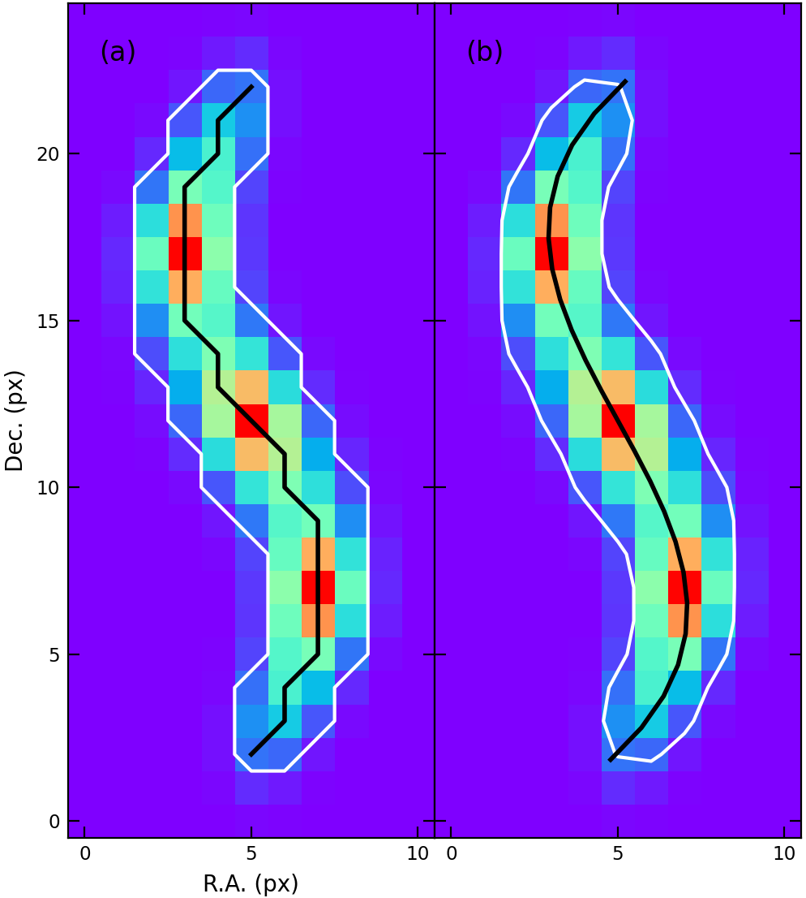
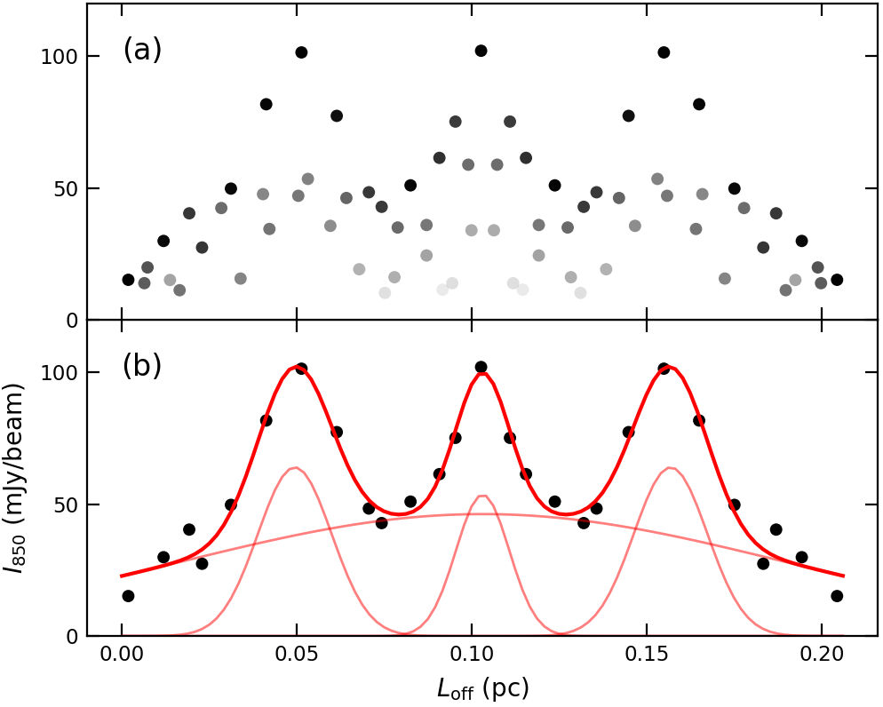
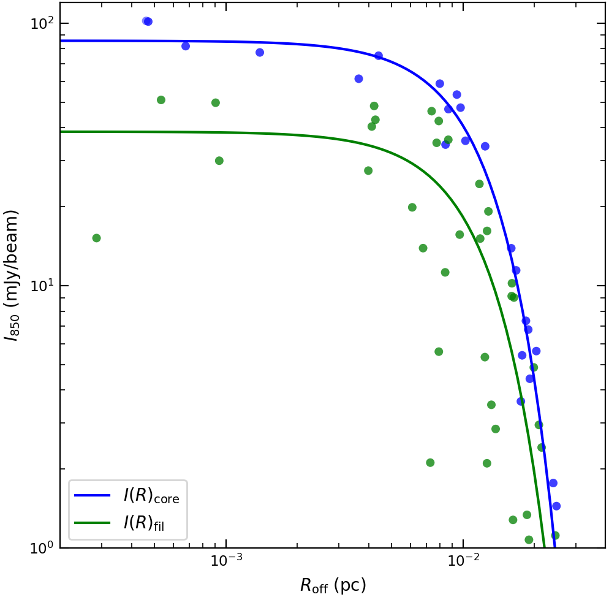
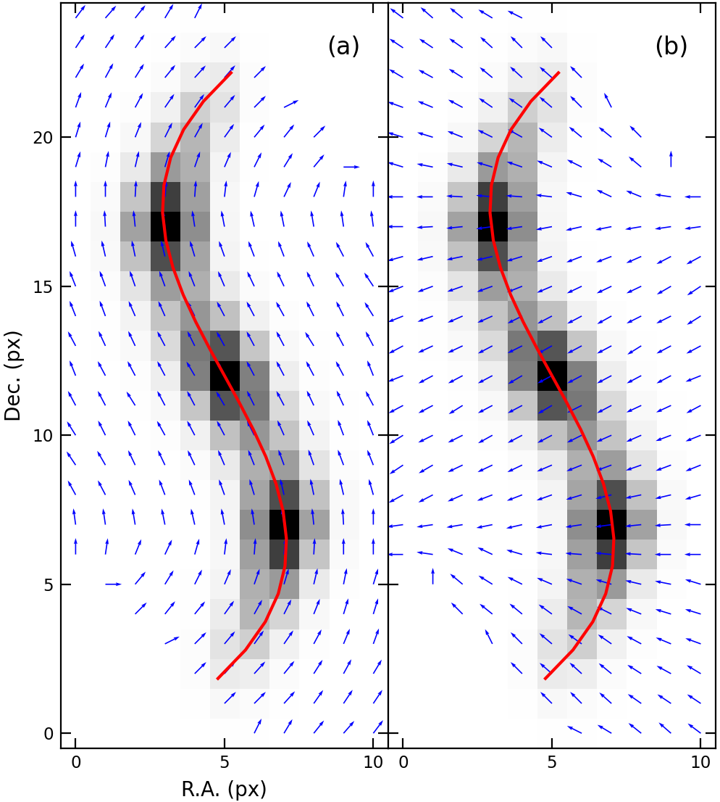

# Pixel Coordinates for Filament Study
{: .no_toc }

## Table of contents
{: .no_toc .text-delta }

1. TOC
{:toc}

---

## Pixelated skeleton vs. B-spline skeleton


Figure 1. 
(a) Emission (or density) distribution obtained from observation. 
(b) Mask (red contour) and skeleton (grey pixels), the output result of `fil_finder` algorithm.
(c) Pixelated skeleton vs. B-spline skeleton (blue dots).
(d) L_off, the offset position along the filament.
(e) R_off, the radial distance from the skeleton.

### Pixelated skeleton

- No further work, can use the result of `fil_finder`.
- Hard to analyze longitudinal or radial profiles.
- Difficult to get the distance between two positions on the skeleton.
- Not good-looking for drawing figures

### B-spline skeleton

- Need extra work, but short and not difficult.
- Non-pixelated and continuously curved.
- Easy to plot something with respect to the longitudinal offset position or the radial distance from the skeleton.
- Closer to nature and look nicer.

## Example data

[Download](./skeleton.dat)

The example data was made up of virtual to have the same contents as the output result of the `fil_finder` algorithm. 
This is a python dictionary, containing the image, the mask, and the skeleton data, saved to the `pickle`.

```python
skeleton = {'image': numpy.2darray,    # map from observation, dtype('float')
            'mask': numpy.2darray,     # filament mask, dtype('bool')
            'skeleton': numpy.2darray, # skeleton image, dtype('bool')
            'x': numpy.1darray,        # x coordinate of skeleton pixels, dtype('int')
            'y': numpy.1darray}        # y coordinate of skeleton pixels, dtype('int')
```

## Make new pixel coordinates based on the skeleton.

We can assign all of the pixels new coordinates based on the skeleton. 
It consists of the x-axis as the position offset along the filament (or skeleton) and the y-axis as the radial distance from the skeleton.

### Load libraries and skeleton data

```python
import numpy as np
import pickle
from astropy import units as u
from matplotlib import pyplot as plt
from scipy.interpolate import splprep, splev

with open('skeleton.dat', 'rb') as f:
    skeleton = pickle.load(f)

map = skeleton['image']    # image in Fig. 1 (a).
mask = skeleton['mask']    # red contour in Fig. 1 (b).
pts = skeleton['skeleton'] # grey pixels in Fig. 1 (b) and (c).
rp = skeleton['x']
dp = skeleton['y']
```

### Calculate filament length: sum of point-to-point separation

```python
len_ptp = np.sqrt((dp[1:]-dp[:-1])**2+(rp[1:]-rp[:-1])**2).sum()
print('L_fil (ptp) = {:.3f} pixel'.format(len_ptp))
```

### Make B-spline skeleton

```python
tck, _ = splprep([rp, dp])
sx, sy = splev(np.linspace(0, 1, int(len_ptp+0.5)), tck)
len_spl = np.sqrt((sx[1:]-sx[:-1])**2+(sy[1:]-sy[:-1])**2).sum()
print('L_fil (spl) = {:.3f} pixel'.format(len_spl))
```
- `tck` : a tuple containing the vector of knots, the B-spline coefficients, and the degree of the spline.
- `sx` : x coordinate of B-spline skeleton, blue dots in Fig 1 (c)
- `sy` : y coordinate of B-spline skeleton, blue dots in Fig 1 (c)

### Make new pixel coordinates

```python
ll = np.linspace(0, 1, int(len_spl*10))
dx, dy = splev(ll, tck)
ll *= np.sqrt((dx[1:]-dx[:-1])**2+(dy[1:]-dy[:-1])**2).sum()

xoff = np.full_like(map, np.nan)
yoff = np.full_like(map, np.nan)

for d in range(map.shape[0]):
    for r in range(map.shape[1]):
        separation = (dx-r)**2+(dy-d)**2
        index = np.argmin(separation)
        xoff[d, r] = ll[index]
        yoff[d, r] = np.sqrt(separation[index])
```
- `xoff` : offset position along the filament, image in Fig 1 (d)
- `yoff` : radial distance from the skeleton, image in Fig 1 (e)

### Convert unit from pixel to pc

```python
pixel_scale = 4*u.arcsec
distance = 470*u.pc

xoff_pc = xoff*pixel_scale.value*distance.value*u.au.to(u.pc)
yoff_pc = yoff*pixel_scale.value*distance.value*u.au.to(u.pc)
```

### Save result

```python
skeleton['sx'] = sx
skeleton['sy'] = sy
skeleton['length'] = len_spl
skeleton['length_pc'] = len_spl*pixel_scale.value*distance.value*u.au.to(u.pc)
skeleton['xoff'] = xoff
skeleton['xoff_pc'] = xoff_pc
skeleton['yoff'] = yoff
skeleton['yoff_pc'] = yoff_pc

with open('skeleton.dat', 'wb') as f:
    pickle.dump(skeleton, f)
```

### Draw result figure

Script for Figure 1.

```python
fig, ax = plt.subplots(1, 5, sharex='all', sharey='all')

ax[0].imshow(map, origin='lower', cmap='rainbow')
ax[0].set_xlabel('R.A. (px)')
ax[0].set_ylabel('Dec. (px)')

ax[1].imshow(pts, origin='lower', cmap='Greys', vmin=0, vmax=2)
ax[1].contour(mask, levels=[0.5], colors='r')

ax[2].imshow(pts, origin='lower', cmap='Greys', vmin=0, vmax=2)
ax[2].scatter(sx, sy, s=4, c='b')

ax[3].imshow(xoff, origin='lower', cmap='rainbow')
ax[3].contour(mask, levels=[0.5], colors='k')

ax[4].imshow(yoff, origin='lower', cmap='rainbow')
ax[4].contour(mask, levels=[0.5], colors='k')

for i, ii in enumerate('abced'):
    ax[i].annotate('({})'.format(ii), xy=(1, 23), fontsize='large', ha='center', va='center')

for i in range(5):
    ax[i].set_xticks([0, 5, 10])

fig.savefig('fig_new_coords_from_skeleton.pdf')
```

## Examples using the filament coordinates

### Load libraries and skeleton data

```python
import numpy as np
import pickle
from astropy.modeling.models import Gaussian1D
from astropy.modeling.fitting import LevMarLSQFitter
from funstools import smooth2d
from matplotlib import pyplot as plt

with open('skeleton.dat', 'rb') as f:
    skel = pickle.load(f)
```

### Example 1. Filament map with skeleton


Figure 2.
Emission maps with the mask (white contour) and the skeleton (black curve).
(a) Pixelated skeleton.
(b) B-spline skeleton.

```python
fig, ax = plt.subplots(1, 2, sharey='all')

ax[0].imshow(skel['image'], origin='lower', cmap='rainbow')
ax[0].contour(skel['mask'], levels=[0.5], colors='w')
ax[0].plot(skel['x'], skel['y'], color='k', lw=2)
ax[0].set_xlabel('R.A. (px)')
ax[0].set_ylabel('Dec. (px)')

ax[1].imshow(skel['image'], origin='lower', cmap='rainbow')
ax[1].contour(smooth2d(skel['mask'], 2), levels=[0.5], colors='w')
ax[1].plot(skel['sx'], skel['sy'], color='k', lw=2)

for i in range(2):
    ax[i].set_xticks([0, 5, 10])

for i, ii in enumerate('ab'):
    ax[i].annotate('({})'.format(ii), xy=(1, 23), fontsize='large', ha='center', va='center')

fig.savefig('fig_example_map.pdf')
fig.savefig('fig_example_map.png', dpi=200)
```

### Example 2. Longitudinal profile along the skeleton and model fit

Filament coordinates make easy to prepare data for model fit.

```python
# make masks
mask1 = skel['mask']
mask2 = mask1 & (skel['yoff'] < 0.5)

# prepare model fitting
x = skel['xoff_pc'][mask2]
y = skel['image'][mask2]

model_core1 = Gaussian1D(50, 0.05, 0.01)
model_core2 = Gaussian1D(50, 0.1, 0.01)
model_core3 = Gaussian1D(50, 0.15, 0.01)
model_filament = Gaussian1D(50, 0.1, 0.1)
composite_model = model_core1+model_core2+model_core3+model_filament

# fitting and best-fit results
fitter = LevMarLSQFitter()
fit = fitter(composite_model, x, y)

core1 = fit[0]
core2 = fit[1]
core3 = fit[2]
filament = fit[3]
```


Figure 3.
850 micron emission distribution along the filament.
(a) All detected pixels within the filament boundary (mask).
The points' darkness decreases with radial distance from the skeleton.
(b) only the pixels located on the skeleton.
The red curves show best-fit models that contain a filament and three cores.

```python
# make color tone of pixels to show radial distance from skeleton
tone = 2-skel['yoff']
tone = tone/tone[mask1].max()

# make x data to plot best-fit model
fit_x = np.linspace(0, skel['length_pc'], 100)

# draw figure
fig, ax = plt.subplots(2, 1, sharex='all')

ax[0].scatter(skel['xoff_pc'][mask1], skel['image'][mask1], s=25, c='k', ec='none', alpha=tone[mask1])

ax[1].scatter(skel['xoff_pc'][mask2], skel['image'][mask2], s=25, c='k', ec='none')
for model in [core1, core2, core3, filament]:
    ax[1].plot(fit_x, model(fit_x), color='r', lw=1, alpha=0.5)
ax[1].plot(fit_x, fit(fit_x), color='r', lw=1.5)
ax[1].set_xlabel(r'$L_\mathrm{off}$ (pc)')
ax[1].set_ylabel(r'$I_{850}$ (mJy/beam)')

for i in range(2):
    ax[i].set_xlim(-0.01, 0.216)
    ax[i].set_ylim(0, 120)
    ax[i].set_xticks(np.arange(0, 0.25, 0.05))
    ax[i].set_yticks([0, 50, 100])

for i, ii in enumerate('ab'):
    ax[i].annotate('({})'.format(ii), xy=(0.07, 0.85), xycoords='axes fraction', fontsize='large', ha='center', va='center')

fig.savefig('fig_example_longitudinal_profile.pdf')
fig.savefig('fig_example_longitudinal_profile.png', dpi=200)
```

### Example 3. Measure core separations.

Using the results of Example 2.

```python
sep1 = core2.mean.value-core1.mean.value
sep2 = core3.mean.value-core2.mean.value
sep = np.mean([sep1, sep2])
print('core_separation1 = {:.3f} pc'.format(sep1))
print('core_separation2 = {:.3f} pc'.format(sep2))
print('Mean_core_seps = {:.3f} pc'.format(sep))
```

### Example 4. Measure filament width from the radial profile of filament

Using the results of Example 2 and 3.

```python
# divide core and filament region
mask_core = np.abs(skel['xoff_pc']-core1.mean.value) < sep/4
mask_core += np.abs(skel['xoff_pc']-core2.mean.value) < sep/4
mask_core += np.abs(skel['xoff_pc']-core3.mean.value) < sep/4
mask_fil = ~mask_core

# fit with Gaussian model
fit = []

for mask in [mask_core, mask_fil]:
    mask = mask & (skel['image'] > 1.)
    x = skel['yoff_pc'][mask]
    y = skel['image'][mask]

    fitter = LevMarLSQFitter()
    model = Gaussian1D(y.max(), 0, 0.02)
    model.mean.fixed = True
    fit.append(fitter(model, x, y))

print('filament_width1 = {:.3f} pc'.format(fit[0].fwhm))
print('filament_width2 = {:.3f} pc'.format(fit[1].fwhm))
```


Figure 4.
Radial intensity profile of the filament.
Blue dots and curve show the data and best-fit model for the core region,
and green dots and curve show those for the filament region without core.

```python
# maks x data to plot best-fit model
fit_x = 10**np.linspace(-3.7, -1.4, 100)

# draw figure
fig, ax = plt.subplots(1, 1)

ax.loglog()
ax.scatter(skel['yoff_pc'][mask_core], skel['image'][mask_core], s=25, c='b', ec='none', alpha=0.5)
ax.scatter(skel['yoff_pc'][mask_fil], skel['image'][mask_fil], s=25, c='g', ec='none', alpha=0.5)
ax.set_ylim(1, 120)
ax.set_xlim(10**-3.7, 10**-1.4)
ax.plot(fit_x, fit[0](fit_x), color='b', label=r'$I(R)_\mathrm{core}$')
ax.plot(fit_x, fit[1](fit_x), color='g', label=r'$I(R)_\mathrm{fil}$')

ax.set_xlabel(r'$R_\mathrm{off}$ (pc)')
ax.set_ylabel(r'$I_{850}$ (mJy/beam)')
ax.legend(loc='lower left')

fig.savefig('fig_example_radial_profile.pdf')
fig.savefig('fig_example_radial_profile.png', dpi=200)
```

### Example 5. Parallel or normal vectors to the skeleton.

Easy to calculate angles of parallel or normal to the skeleton for each pixel.

```python
# calculate parallel vectors for all pixels
grad = np.gradient(skel['xoff'])
ang = np.arctan(grad[0]/grad[1])

# align direction
ang[ang < 0] += np.pi
ang[ang > np.pi] -= np.pi
```


Figure 5.
(a) Parallel vectors to the skeleton on each pixel.
(b) Normal vectors.

```python
# vector position array
yy, xx = np.mgrid[:25, :11]

# draw figure
fig, ax = plt.subplots(1, 2, sharex='all', sharey='all')

ax[0].imshow(skel['image'], origin='lower', cmap='Greys')
ax[0].plot(skel['sx'], skel['sy'], color='r')
ax[0].quiver(xx, yy, np.cos(ang), np.sin(ang), color='b', scale=20)
ax[0].set_xlabel('R.A. (px)')
ax[0].set_ylabel('Dec. (px)')

ax[1].imshow(skel['image'], origin='lower', cmap='Greys')
ax[1].plot(skel['sx'], skel['sy'], color='r')
ax[1].quiver(xx, yy, np.cos(ang+np.pi/2), np.sin(ang+np.pi/2), color='b', scale=20)

for i in range(2):
    ax[i].set_xticks([0, 5, 10])

for i, ii in enumerate('ab'):
    ax[i].annotate('({})'.format(ii), xy=(9, 23), fontsize='large', ha='center', va='center')

fig.savefig('fig_example_vector.pdf')
fig.savefig('fig_example_vector.png', dpi=200)
```

---