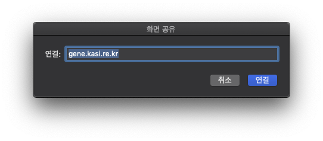
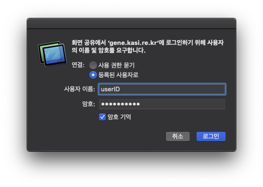
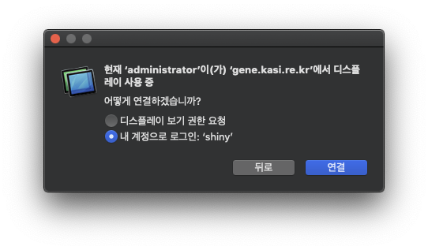
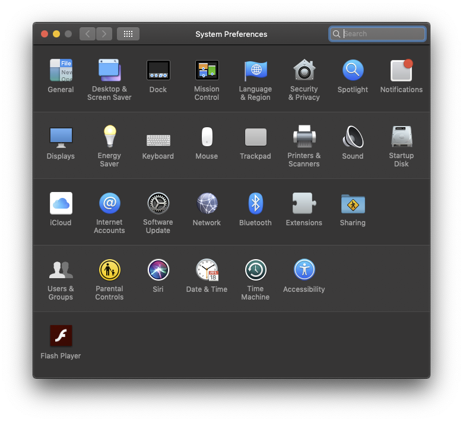
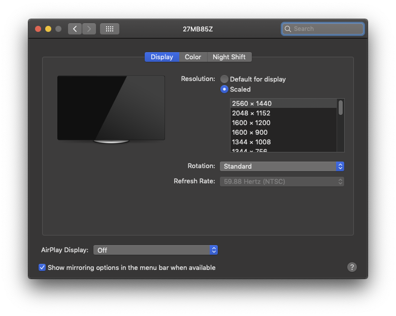

# User guide for gene.kasi.re.kr

## System Information

### Mac Pro (Late 2013)
- **Processor**&emsp;3.5 GHz 6-Core Intel Zeon E6
- **Memory**&emsp;64 GB 1866 MHz DDR3
- **Graphics**&emsp;AMD FirePro D300 2 GB
- **OS**&emsp;macOS Mojave 10.14.6

### Data storage
- **System and Apps**&emsp;1 TB flash storage - Apple SSD
- **User data**&emsp;19 TB external SAS disk - Promise Pegasus2 R8
- **Observation data**&emsp;38 TB external SAS disk - Promise Pegasus3 R8

## Access

### Screen sharing (recommanded)

Using `Screen Sharing.app` in macOS

```
vnc://gene.kasi.re.kr
```

<kbd></kbd>

<kbd></kbd>

<kbd></kbd>

#### Screen size adjustment

When using screen sharing, you may want the screen to fit exactly the size of 
your monitor. The screen size can be adjusted using the `Resolution` option in
`System Preference` > `Display`. Note that **you should never select the 
`Default for display` option** (if you accidentally select that option and you
no longer see the shared screen, you should ask system administrator for help).

<kbd></kbd>

<kbd></kbd>

In the `Scaled` option, you have to select the resolution you want, and if the
desired resolution does not appear, click `Scaled` with the `Option` key to see
all the supported resolution options.

### SSH

```bash
ssh -Y -p 7774 userid@gene.kasi.re.kr
```

In SSH mode, some applications using a Mac GUI other than XQuartz (X window)
can not display additional windows.
For example, you can access the addtional windows in GILDAS or STARLINK, 
but you can not access the viewer and logger window in the CASA.

## Applications

List of pre-installed applications for all users

### macOS

- `CASA`&emsp;5.5.0-149
- `Google Chrome`&emsp;
- `iTerm2`&emsp;
- `Hancom Office HWP 2014 VP`&emsp;10.30.3
- `Keynote`&emsp;10.1
- `Microsoft Excel`&emsp;15.37
- `Microsoft PowerPoint`&emsp;15.37
- `Numbers`&emsp;10.1
- `Pages`&emsp;10.1
- `SAOImage DS9`&emsp;
- `Xcode`&emsp;11.3.1

### macports
- `gcc5`&emsp;5.5
- `gcc9`&emsp;9.1
- `gildas`&emsp;201907a
- `MacVim`&emsp;8.1
- `miriad`&emsp;4.3.8
- `montage`&emsp;3.3
- `py27-virtualenv`&emsp;16.6
- `py37-virtualenv`&emsp;16.6
- `python27`&emsp;2.7.16
- `python37`&emsp;3.7.3
- `tk`&emsp;8.6.9
- `wget`&emsp;1.20.3

## Directions for use

### Personal data

You should store personal data inside your home directory, `/Volumes/DATA/userid`.

### Data sharing
Team shared directory, `/Volumes/DATA/shared`, allows to share data with other users.  
Your home has a soft link to the shared directory.

```bash
mv data_for_sharing ~/shared/data_for_sharing
chmod -R 755 ~/shared/data_for_sharing
```

## Contact to admin

`shinykim@kasi.re.kr`

- **Installing applications**&emsp;Send me application name and url
- **Connection**&emsp;Send me the error message or captured screen

